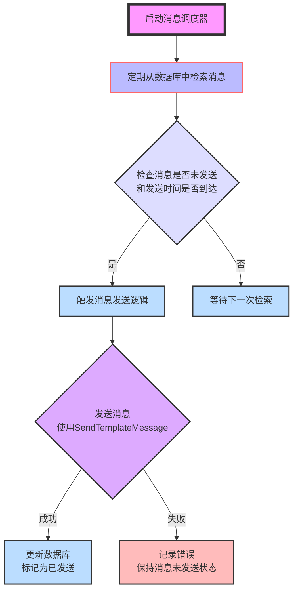

[TOC]
# TODO

- [X] 设置 Go 项目，创建测试路由
- [X] 编写简单数据库模型和接口
- [X] 配置文件，数据库连接
- [X] 通过docker-compose部署测试
- [x] 完善数据库模型
  - [x] 在model中加入新模型时，需要在init中进行迁移
  - [x] 在service中实现对模型的增删改查
  - [x] 在handler中实现API接口，并注册路由
- [x] 用户登录，主要通过微信接口实现
- [x] 对有需要的模型在获取时进行分页、排序(时间排序)和筛选(按疫苗)
  - [x] 社区帖子
- [x] 更方便地通过json数据更新数据库
- [ ] 更新文档中相关API
- [x] 接种记录的字段完善
- [x] 收藏帖子和疫苗
- [x] 解耦 接种记录 和 接种预约
- [x] 根据疫苗筛选帖子
- [x] 消息提醒的发送 (https://developers.weixin.qq.com/miniprogram/dev/framework/open-ability/subscribe-message.html)
- [x] 图床
- [x] github action
- [x] token验证
- [x] 加密
- [x] 代码规范(配置文件)，详细注释
- [x] 数据库时区更改
- [ ] 单元测试
- [x] 性能测试
- [x] 路由拦截和重定向，部署时只暴露api接口


# API 设计

这部分介绍提供给前端的 API 接口，包括请求方法、请求路径、请求参数、请求体、响应体等。

## 用户

登录(通过微信接口而无需密码)，修改个人信息

| 方法 | 路由 | 功能 |
| ---- | ---- | ---- |
| GET | /api/users/login?code=xxx | 通过微信接口登录，第一次登录时会自动注册 |
| GET | /api/users | 获取全部用户信息 |
| PUT | /api/users/:id | 更新指定 id 的用户信息 |
| GET | /api/users/:id/following | 获取指定 id 的用户关注的所有用户 |
| GET | /api/users/addfollowingVaccine/:id?vaccine_id | 指定 id 的用户关注指定 vaccine_id 的疫苗 |
| GET | /api/users/removefollowingVaccine/:id?vaccine_id | 指定 id 的用户取消关注指定 vaccine_id 的疫苗 |
| GET | /api/users/addfollowingArticle/:id?article_id | 指定 id 的用户关注指定 article_id 的帖子 |
| GET | /api/users/removefollowingArticle/:id?article_id | 指定 id 的用户取消关注指定 article_id 的帖子 |


Put 时的 json样例：
```json
{
   //"openId": "1234567890", // OpenID将在通信时忽略
   "userName": "张三",
   "email": "123@mails.tsinghua.edu.cm",
   "phone": "1234567890",
   "avatar": "http://xxx.com/xxx.jpg"
}
```

## 身份

| 方法 | 路由 | 功能 |
| ---- | ---- | ---- |
| POST | /api/profiles | 添加身份 |
| GET | /api/profiles | 获取全部身份信息 |
| GET | /api/profiles/:id | 获取指定 id 的身份信息 |
| GET | /api/profiles/user/:id | 获取指定 id 的用户管理的所有身份信息 |
| PUT | /api/profiles/:id | 更新指定 id 的身份信息 |
| DELETE | /api/profiles/:id | 删除指定 id 的身份 |

Post 时的json样例
```json
{
   "userId": 1,
   "fullName": "张三",
   "Gender": "男",
   "dateOfBirth": "1999-01-01",
   "relationship": "本人"
}
```


## 接种记录

| 方法 | 路由 | 功能 |
| ---- | ---- | ---- |
| POST | /api/vaccination-records | 添加接种记录 |
| GET | /api/vaccination-records?isCompleted=true | 获取全部已完成接种记录(若为false则获取未完成接种记录) |
| GET | /api/vaccination-records/:id | 获取指定 id 的接种记录 |
| GET | /api/vaccination-records/user/:userID | 获取指定 userID 的用户的接种记录 |
| GET | /api/vaccination-records/profile/:profileID?isCompleted=true | 获取指定 profileID 的接种者的已完成接种记录(若为false则获取未完成接种记录) |
| PUT | /api/vaccination-records/:id | 更新指定 id 的疫苗信息 |
| DELETE | /api/vaccination-records/:id | 删除指定 id 的疫苗信息 |

Post 时的json样例：
```json
{
   "profileId": 1, // 接种者的id, 必填
   "vaccineId": 2, // 疫苗的id, 必填
   "voucher": "Voucher123", // 接种凭证, 选填
   "vaccinationDate": "2021-07-01", // 接种日期, 必填
   "vaccinationLocation": "本地社区医院",
   "vaccinationType": "第一针", // 接种类型, 选填
   "nextVaccinationDate": "2021-08-01", // 下次接种日期, 选填
   "note": "无明显不适反应", // 备注, 选填
   "isCompleted": true, // 是否已完成接种, 选填
   "reminder": true, // 是否提醒本次接种，仅在isCompleted为false时有效，选填
   "remindTime": "2021-06-30 12:00" // 提醒时间，仅在isCompleted为false且reminder为true时有效，选填
}
```

## 体温记录

| 方法 | 路由 | 功能 |
| ---- | ---- | ---- |
| POST | /api/temperature-records | 添加体温记录 |
| GET | /api/temperature-records | 获取全部体温记录 |
| GET | /api/temperature-records/:id | 获取指定 id 的体温记录 |
| GET | /api/temperature-records/user/:id | 获取指定 id 的用户的体温记录 |
| GET | /api/temperature-records/profile/:id | 获取指定 id 的接种者的体温记录 |
| PUT | /api/temperature-records/:id | 更新指定 id 的体温记录 |
| DELETE | /api/temperature-records/:id | 删除指定 id 的体温记录 |

json样例：
```json
{
  "profileId": 1,
  "date": "2023-09-01 12:00",
  "temperture": 36.7
}
```

## 帖子

| 方法 | 路由 | 功能 |
| ---- | ---- | ---- |
| POST | /api/articles | 发布帖子 |
| GET | /api/articles?size=10&page=1&isBind=true&vaccineId=1&inverted=true | 获取全部帖子，可选参数：size(每页大小，默认获取全部)、page(页码，默认为1)、isBind(是否绑定疫苗，不绑定则归为其他类型，默认获取全部)、vaccineId(疫苗id，不指定则获取全部)、inverted(是否倒序，默认为true) |
| GET | /api/articles/:id | 获取指定 id 的帖子 |
| GET | /api/articles/user/:userID | 获取指定 userID 的用户发布的所有帖子 |
| PUT | /api/articles/:id | 更新指定 id 的帖子 |
| DELETE | /api/articles/:id | 删除指定 id 的帖子 |

Post 时的json样例：
```json
{
   "title": "疫苗接种经历",
   "content": "今天去接种了新冠疫苗，感觉还不错",
   "userName": "张三",
   "userId": 1,
   "isBind": true,
   "vaccineId": 1
}
```

## 回复

| 方法 | 路由 | 功能 |
| ---- | ---- | ---- |
| POST | /api/replys | 发布回复 |
| GET | /api/replys?articleId=1 | 获取指定 articleId 的帖子的所有回复，如果不指定 articleId 则获取全部回复 |
| GET | /api/replys/:id | 获取指定 id 的回复 |
| PUT | /api/replys/:id | 更新指定 id 的回复 |
| DELETE | /api/replys/:id | 删除指定 id 的回复 |

Post 时的json样例：
```json
{
   "articleId": 1,
   "content": "我也是",
   "userName": "李四",
   "userId": 2
}
```

## 消息

| 方法 | 路由 | 功能 |
| ---- | ---- | ---- |
| POST | /api/messages | 添加消息 |
| GET | /api/messages | 获取全部消息 |
| GET | /api/messages/:id | 获取指定 id 的消息 |
| PUT | /api/messages/:id | 更新指定 id 的消息 |
| DELETE |/api/messages/:id | 删除指定 id 的消息 |

Post 时的json样例：
```json
{
   "userId": 1,
   //"openId": "1234567890", // OpenID将在通信时忽略
   "page": "pages/welcome/welcome",
   "vaxName": "新冠疫苗",
   "comment": "您的接种时间已到",
   "vaxLocation": "本地社区医院",
   "vaxNum": 1,
   "realTime": true,
   "sendTime": "2021-07-01 12:00",
   "sent": false
}
```

| POST | /api/messagesSubscribe | 给所有订阅了该疫苗的用户发送消息 |

Post 时的json样例：
注意vaccineId和vaxName没有做关联，需要前端保证一致性；如果不一致，vaccineId用于查找订阅了该疫苗的用户，vaxName用于消息内容
```json
{
   "vaccineId": 1,
   "page": "pages/welcome/welcome",
   "vaxName": "新冠疫苗",
   "vaxLocation": "本地社区医院",
}
```

# 模型设计

通过以下数据表来支持后端的功能：

1. **用户表 (Users)**:

```go
// User 用户模型
// 查询关注的疫苗和文章时，使用 Preload 方法
// 增加和删除关注的疫苗和文章时，使用 Association 方法
type User struct {
	gorm.Model                  //gorm.Model 包含了 CreatedAt、UpdatedAt、DeletedAt（用于软删除）以及 ID 字段
	OpenID            string    `gorm:"unique" json:"openId"`
	UserName          string    `json:"userName"`
	Password          string    `json:"-"` // 存储哈希值，JSON中忽略 -> 使用微信API，不需要密码
	Email             string    `json:"email"`
	Phone             string    `json:"phone"`
	Avatar            string    `json:"avatar"`                                                      // 头像链接
	FollowingVaccines []Vaccine `gorm:"many2many:user_following_vaccines;" json:"followingVaccines"` // 用户关注的疫苗
	FollowingArticles []Article `gorm:"many2many:user_following_articles;" json:"followingArticles"` // 用户关注的文章
}
```


2. **身份表 (Profiles)**:

```go
// Profile 身份模型
type Profile struct {
	gorm.Model
	UserID       uint   `json:"userId"`
	FullName     string `json:"fullName"`
	Gender       string `json:"gender"`
	DateOfBirth  string `json:"dateOfBirth"`
	Relationship string `json:"relationship"`
}
```


3. **疫苗表 (Vaccines)**:

```go
// Vaccine 疫苗模型
type Vaccine struct {
	gorm.Model
	Name          string `json:"name"`
	Description   string `json:"description"`
	TargetDisease string `json:"targetDisease"`
	SideEffects   string `json:"sideEffects"`
	Precautions   string `json:"precautions"` // 接种前注意事项
	ValidPeriod   int    `json:"validPeriod"` // 有效期，单位为天
	Type          string `json:"type"`        // 疫苗类型，常规疫苗、特殊疫苗、其他
}
```

修改数据库初始疫苗信息 `pkg/db/vaxinfo.json`


4. **接种记录表 (VaccinationRecords)**:

```go
// VaccinationRecord 接种记录模型
// 对应一个Profile和一个Vaccine，记录接种类型、接种时间、接种地点、接种凭证、疫苗失效时间、备注，同时希望能看到疫苗的详细信息(名称、有效期...)
// 是否完成接种，未完成则为预约接种
// 是否提醒，提醒时间，用字符串存具体时间，例如"2021-07-01 12:00"
type VaccinationRecord struct {
	gorm.Model
	ProfileID           uint    `json:"profileId"`
	VaccineID           uint    `json:"vaccineId"`
	Vaccine             Vaccine `gorm:"foreignKey:VaccineID" json:"vaccine"`
	VaccinationDate     string  `json:"vaccinationDate"` // 注意用string与前端交互，例如"2021-07-01"
	Voucher             string  `json:"voucher"`         // 接种凭证，之后实现为图片链接
	VaccinationLocation string  `json:"vaccinationLocation"`
	VaccinationType     string  `json:"vaccinationType"`     // 接种类型，第一针、第二针、加强针
	NextVaccinationDate string  `json:"nextVaccinationDate"` // 疫苗失效时间
	Note                string  `json:"note"`

	IsCompleted bool   `json:"isCompleted"` // 是否完成接种，未完成则为预约接种
	Reminder    bool   `json:"reminder"`    // 是否提醒
	RemindTime  string `json:"remindTime"`  // 提醒时间，用字符串存具体时间，例如"2021-07-01 12:00"
}
```


5. **体温记录表 (TemperatureRecords)**:

```go
// TemperatureRecord 体温记录模型
type TemperatureRecord struct {
   gorm.Model
   ProfileID uint    `json:"profileId"`
   Date      string  `json:"date"` // 包含日期和时间，例如"2021-07-01 12:00"
   Temperature float32 `json:"temperature"`
}
```


6. **文章表 (Articles)**:

```go
// Article 文章模型，与疫苗绑定
type Article struct {
   gorm.Model
   Title     string `json:"title"`
   Content   string `json:"content"`
   UserName  string `json:"userName"`
   UserID    uint   `json:"userId"`
   IsBind    bool   `json:"isBind"` // 是否绑定疫苗，如果未绑定，则归为其他类型
   VaccineID uint   `json:"vaccineId"`
}
```


7. **回复表 (Replys)**:

```go
type Reply struct {
   gorm.Model
   ArticleID uint   `json:"articleId"`
   Content   string `json:"content"`
   UserName  string `json:"userName"`
   UserID    uint   `json:"userId"`
}
```


8. **消息提醒表 (Messages)**:

```go
// Message 消息模型
type Message struct {
	gorm.Model
	OpenID      string `json:"openId"`
	Page        string `json:"page"` // 消息跳转页面，例如"pages/welcome/welcome"
	VaxName     string `json:"vaxName"`
	Comment     string `json:"comment"`
	VaxLocation string `json:"vaxLocation"`
	VaxNum      int    `json:"vaxNum"`
	RealTime    bool   `json:"realTime"` // 是否实时提醒
	SendTime    string `json:"sendTime"` // 如果不是实时提醒，则需要设置提醒时间，用字符串存具体时间，例如"2021-07-01 12:00"
	Sent        bool   `json:"sent"`     // 是否已发送
}
```

9. **接种地点表 (VaccinationLocations)**:

```go
// 持有某种疫苗的所有诊所
type VaccineClinicList struct {
	gorm.Model
	VaccineName string `json:"vaccineName"`
	ClinicList  string `json:"clinicList"`
	// ClinicName  StringList `json:"clinicName"`
}

// 诊所信息
type Clinic struct {
	gorm.Model
	ClinicName  string `json:"clinicName"`
	VaccineList string `json:"vaccineList"`
	Latitude    string `json:"latitude"`
	Longitude   string `json:"longitude"`
	PhoneNumber string `json:"phoneNumber"`
	Address     string `json:"address"`
}
```

## 后端架构文档

### 1. **Web框架**
- 使用Go作为后端开发语言。
- 采用Gin框架来构建RESTful API，提供了高性能和简洁的路由功能。

### 2. **数据库**
- 使用MySQL作为关系型数据库。
- 通过GORM库实现对象关系映射（ORM），简化数据库操作。

### 3. **API服务**
- 设计和实现REST API，处理各种HTTP请求。
- 提供用户认证、数据检索、创建、更新和删除等功能。

### 4. **身份认证**
- 实现Token-based认证机制，使用JWT（JSON Web Tokens）进行身份验证和授权。
- 提供安全的用户登录流程，并保护API访问。

### 5. **模型**
- 定义数据模型，如用户、疫苗、文章等，使用Go结构体表示。
- 确保模型与数据库表结构一致。

### 6. **服务层**
- 封装业务逻辑于服务层，例如用户管理、疫苗信息处理等。
- 分离业务逻辑与API处理，提高代码可维护性。

### 7. **错误处理**
- 实现统一的错误处理机制。
- 捕获异常，返回标准化的错误响应。

### 8. **Docker容器**
- 使用Docker进行应用容器化，确保一致的开发、测试和生产环境。
- 使用`docker-compose`来管理多个容器服务。

### 9. **数据库迁移**
- 使用数据库迁移工具（如Flyway或Liquibase）管理数据库结构的更改。
- 确保数据库结构的版本控制和追踪。

### 10. **日志记录**
- 实现日志记录系统，记录关键操作和错误信息。
- 使用标准日志库或第三方日志服务。

### 11. **前端集成**
- 后端API与前端小程序集成，通过JSON格式交换数据。
- 确保API的响应格式符合前端需求。

### 12. **GitHub Actions**
- 使用GitHub Actions实现CI/CD流程，自动化测试和部署流程。
- 自动化构建Docker镜像，并部署到生产环境。

### 13. **文件结构和代码组织**
- 明确的项目结构，便于开发和维护：
  - `cmd`: 存放程序的入口。
  - `deployments`: 包含Docker相关配置和Dockerfile。
  - `internal`: 存放私有应用和库代码。
  - `pkg`: 存放可被外部应用使用的库代码。
  - `tests`: 存放测试代码和性能测试脚本。

### 14. **性能监控和优化**
- 监控应用性能，定期进行性能测试。
- 分析性能瓶颈并进行优化。

### 15. **安全措施**
- 采取安全措施保护敏感数据。
- 定期更新依赖，修复安全漏洞。


## 项目优化

在使用Go语言的Gin框架、Gorm ORM、Nginx作为路由器，以及MySQL作为数据库的项目中，下面是一些具体的最佳实践和注意事项，以确保后端服务的安全性、性能、可靠性和可维护性：

### 安全性
1. **使用中间件实现认证和授权**：
   - 使用Gin的中间件来处理JWT（JSON Web Tokens）或OAuth认证。
   - 对敏感路由（如用户数据修改、管理员功能等）实施权限检查。

2. **SQL注入防御**：
   - Gorm自身提供了防止SQL注入的措施。确保始终使用Gorm的方法来构建查询，避免直接拼接SQL字符串。

3. **输入验证**：
   - 在处理来自客户端的数据时，始终进行验证。使用Gin的绑定和验证功能来验证请求数据。

4. **HTTPS配置**：
   - 即使Nginx处理HTTPS，也应在Gin中正确配置SSL，尤其是当应用直接暴露到外网时。

### 性能和可伸缩性
1. **数据库连接池管理**：
   - 适当配置Gorm的数据库连接池参数，如MaxOpenConns（最大打开连接数）、MaxIdleConns（最大空闲连接数）和ConnMaxLifetime（连接的最大存活时间）。

2. **查询优化**：
   - 使用Gorm的懒加载特性，并在必要时使用预加载（`.Preload`）来减少数据库查询次数。

3. **使用缓存**：
   - 考虑使用Redis等缓存机制来存储热点数据，减少对数据库的直接访问。

### 可靠性和可用性
1. **错误处理**：
   - 在Gin中使用恢复中间件（Recovery Middleware）来处理panic情况。
   - 记录详细的错误日志，可以使用如Logrus等日志库。

2. **数据备份和迁移策略**：
   - 定期备份MySQL数据库。
   - 使用如Flyway或Liquibase等数据库迁移工具来管理数据库的版本和迁移。

### 代码质量和维护性
1. **代码结构**：
   - 将业务逻辑、数据访问和API路由清晰分离。
   - 遵循Go语言的编码规范和最佳实践。

2. **单元测试**：
   - 编写单元测试来验证业务逻辑，可以使用Go自带的测试框架。

### 部署和持续集成
1. **Docker化应用**：
   - 使用Docker来容器化您的应用，这有利于确保一致的部署和运行环境。
   - 使用Docker Compose或Kubernetes来管理容器和服务。

2. **CI/CD流程**：
   - 使用如Jenkins、Travis CI或GitHub Actions等CI/CD工具自动化测试、构建和部署流程。

### Nginx配置
1. **路由配置**：
   - 使用Nginx处理静态内容和反向代理到Gin应用。
   - 配置HTTPS，重定向所有HTTP流量到HTTPS。
   - 实现必要的安全性头部，如CSP、HSTS等。

### 数据库和数据模型
1. **Gorm模型设计**：
   - 精心设计数据库模型和关联，以优化性能和简化数据访问逻辑。
   - 使用迁移来管理数据库结构的更改。

## 部署
用配置文件定义GitHub Actions的工作流程，用于自动化Docker容器化的Go后端应用程序的构建和部署。以下是该工作流程的详细步骤和解释：

### 工作流程触发条件

```yaml
on:
  push:
    branches: [ go-backend, backend-dev ]
```

- 工作流程在`go-backend`和`backend-dev`分支上的推送事件时触发。
- 这意味着每当有新的代码提交到这两个分支时，GitHub Actions将自动执行定义的步骤。

### 工作流程任务：build-and-deploy

```yaml
jobs:
  build-and-deploy:
    runs-on: ubuntu-latest
```

- 定义了一个名为`build-and-deploy`的任务。
- 该任务在最新版本的Ubuntu环境上运行。

### 步骤1：检出代码

```yaml
- uses: actions/checkout@v2
```

- 使用`actions/checkout@v2`动作检出您的代码库到GitHub Actions运行器中。

### 步骤2：部署到服务器

```yaml
- name: Deploy to Server
  run: |
    sshpass -p "xxxxxx" ssh -o StrictHostKeyChecking=no ubuntu@101.43.194.58 "cd /home/ubuntu/backend/A08_V-Helper && git pull && cd go-backend && sudo docker-compose up --build -d"
```

- 使用SSH连接到部署服务器（IP地址为`101.43.194.58`）。
- 执行一系列命令来部署应用：
  - 切换到项目目录。
  - 拉取最新代码。
  - 在`go-backend`目录中运行`docker-compose up --build -d`来构建并后台运行容器化应用。

### 安全注意事项

- SSH密码直接写在了脚本中，这可能会引起安全问题。建议使用更安全的认证方式，如SSH密钥。
- 如果未来您想要使用Docker Hub构建和推送镜像，请确保您的DockerHub凭据是安全的。使用GitHub Secrets来存储敏感信息。

## 性能测试报告

### 测试概述

**测试工具**: 使用Locust 2.20.0进行了性能测试。

**测试目的**: 评估Web应用在并发用户负载下的性能表现。

**测试场景**:
- 测试了六个不同的API端点。
- 总共模拟了200个并发用户。
- 用户生成速率为每秒10个用户。

### 测试结果

**请求统计**:

| 类型 | 路径                        | 请求数  | 失败率 | 平均响应时间 (ms) | 最小响应时间 (ms) | 最大响应时间 (ms) | 请求/秒 |
|------|-----------------------------|---------|--------|-------------------|-------------------|-------------------|---------|
| GET  | /                           | 959     | 0.00%  | 40                | 9                 | 895               | 3.26    |
| GET  | /api/profiles               | 1915    | 0.00%  | 78                | 9                 | 3606              | 6.51    |
| GET  | /api/temperature-records    | 3906    | 0.00%  | 41                | 8                 | 3349              | 13.28   |
| GET  | /api/users                  | 1945    | 0.00%  | 60                | 10                | 1818              | 6.61    |
| GET  | /api/vaccination-records    | 3888    | 0.00%  | 709               | 22                | 16251             | 13.22   |
| GET  | /api/vaccines               | 3905    | 0.00%  | 1127              | 21                | 18216             | 13.28   |

**响应时间分位数**:

不同的API端点在不同的响应时间分位数上表现出了差异。特别是`/api/vaccination-records`和`/api/vaccines`在更高的分位数上显示了较长的响应时间，这可能表明在高负载下这些端点的性能表现下降。

### 性能分析

- **吞吐量**: 所有API端点总体上保持了较高的请求处理率。
- **响应时间**: 大多数API端点的响应时间较短，但`/api/vaccination-records`和`/api/vaccines`的响应时间较长，特别是在95%以上的分位数，表明在高负载下可能存在性能瓶颈。
- **可靠性**: 在测试过程中没有发现失败的请求，这说明服务在测试负载下保持了较高的可靠性。

### 后续

- **性能优化**: 对于响应时间较长的API端点，建议进行更深入的性能分析，以识别和解决可能的瓶颈。
- **资源监控**: 在进行性能测试时监控服务器资源使用情况，如CPU、内存和网络使用情况，以帮助识别性能瓶颈。
- **扩展性评估**: 考虑进行更高负载的测试，以评估服务在极端条件下的表现和扩展需求。

### 总结

总体而言，测试显示了应用在处理中等负载下的良好性能。然而，某些API端点在高分位数的响应时间表明可能存在性能优化的空间。

## 遇到的问题

1. 每次更改后第一次启动app就连不上数据库？需要第2次才能连上

虽然 `depends_on` 确保了服务的启动顺序（即在启动 `app` 之前启动 `db`），但它并不保证 `db`（数据库）服务已经完全启动并准备好接受连接。

换句话说，当 `app` 服务开始启动时，MySQL 数据库可能还没完全初始化完成，这就会导致 `app` 在第一次尝试连接数据库时失败。

### 解决方案

1. **重试逻辑**：在 `app` 服务中添加数据库连接的重试逻辑。许多数据库客户端库提供了重试机制，或者您可以在应用代码中实现。
2. **等待脚本**：在 `app` 服务中使用一个等待脚本，确保在应用启动之前数据库已经准备好。这可以通过编写一个小的 shell 脚本来实现，该脚本在启动应用之前检查数据库连接。
3. **健康检查**：在 `docker-compose.yml` 中为 `db` 服务配置健康检查（healthcheck）。这样，Docker 将等待直到健康检查通过后才视为 `db` 服务已经准备好。

### 示例：等待脚本

这是一个简单的等待脚本示例，可以将它添加到 `app` 服务的 Dockerfile 中：

```bash
# wait-for-it.sh 或类似脚本
while !</dev/tcp/db/3306; do sleep 1; done;
```

然后，在启动应用之前执行这个脚本。

### 示例：Docker Compose 健康检查

在 `docker-compose.yml` 中为 MySQL 服务添加健康检查：

```yaml
services:
  db:
    image: mysql:8.1
    environment:
      MYSQL_ROOT_PASSWORD: ${DB_PASSWORD}
      MYSQL_DATABASE: ${DB_NAME}
    healthcheck:
      test: ["CMD", "mysqladmin", "ping", "-h", "localhost"]
      timeout: 20s
      retries: 10
    # 其他配置...
```

## JWT

JSON Web Token（JWT）是一种开放标准（RFC 7519），用于在两个方之间安全地传输信息。在 Web 应用中，它通常用于身份验证和信息交换。JWT 是一个紧凑的、自包含的方式来安全地传输用户信息。

### JWT 的组成部分

JWT 主要包含三个部分，用点（`.`）分隔：

1. **头部（Header）**

   - 描述 JWT 的元数据，通常包含令牌的类型（`JWT`）和所使用的签名算法（如 `HS256`）。
   - 示例：`{"alg": "HS256", "typ": "JWT"}`
2. **有效载荷（Payload）**

   - 包含所要传递的数据。这些数据称为声明（Claims），包括注册声明（如用户ID，过期时间）和公共声明（如用户名，用户角色）。
   - 示例：`{"sub": "1234567890", "name": "John Doe", "admin": true}`
3. **签名（Signature）**

   - 用于验证消息的完整性和确保消息未被篡改。
   - 生成方式：将编码的头部和有效载荷连同一个密钥使用头部中指定的算法进行签名。

### JWT 鉴权流程

1. **用户登录**

   - 用户通过提供凭证（如用户名和密码）登录。
2. **服务器验证并生成 JWT**

   - 服务器验证用户凭证的有效性。如果验证通过，服务器将创建一个包含用户信息的 JWT。
   - 服务器对 JWT 进行签名，并将其发送回用户。
3. **客户端存储 JWT**

   - 客户端（通常是浏览器）接收 JWT 并将其存储在本地（如 localStorage）。
4. **客户端随请求发送 JWT**

   - 客户端在之后的每个请求的 `Authorization` 头中附带 JWT。
   - 示例：`Authorization: Bearer <token>`
5. **服务器验证 JWT**

   - 每当服务器收到一个请求，它会验证 JWT 的签名。
   - 如果签名有效，服务器将解析 JWT 中的有效载荷以识别和授权用户。

### 具体实现

在`utils/jwt_utils.go`中实现了JWT的生成和验证逻辑，在`internal/handlers/handlers.go`中使用了JWT进行用户认证。

通过使用 JWT，我们可以实现无状态的身份验证，这意味着服务器不需要存储任何用户的登录信息，从而使应用更加易于扩展。同时，它也为客户端和服务器之间的通信提供了一种安全可靠的方式来验证和传输用户身份信息。


## 消息通知

设计一个优雅的系统来处理定时消息发送功能涉及多个方面：数据库设计、消息调度逻辑、错误处理、性能优化等。以下是一个设计方案及其相关思路：

### 1. **系统目标**
- 实现一个可靠的消息调度系统，能够在预定时间发送消息。
- 确保系统可扩展性和高效性能。
- 提供稳健的错误处理和日志记录。

### 2. **数据库设计**
- `messages` 表用于存储消息信息。
  - 字段包括：`id`, `open_id`, `page`, `vax_name`, `comment`, `vax_location`, `vax_num`, `real_time`, `send_time`, `sent`, `created_at`, `updated_at`.
  - `send_time` 用于确定消息发送时间。
  - `sent` 标记消息是否已发送。

### 3. **消息调度逻辑**
- 实现一个消息调度器，定期从数据库中检索未发送的消息，并按`send_time`排序。
- 对于每个未发送的消息，计算当前时间与`send_time`的差值，若到达或超过发送时间，则触发发送逻辑。

### 4. **消息发送机制**
- 消息发送逻辑封装在`SendTemplateMessage`函数中，利用微信小程序的模板消息接口实现。
- 发送成功后，更新数据库中对应消息的`sent`状态为`true`。

### 5. **错误处理和日志记录**
- 在消息发送过程中，任何错误都应被捕获并记录。
- 提供详细的日志记录，包括消息发送时间、状态和任何失败的原因。

#### 6. **性能考虑**
- 消息调度器应避免创建过多goroutine，以减少资源消耗。
- 数据库查询应优化，避免过大的数据加载和频繁查询。




## 对称式加密设计

在Web应用中实现对称式加密和解密的设计，目标是确保敏感数据在客户端和服务器之间安全传输。加密过程在后端进行，而解密过程在前端完成。

### 后端设计

#### 使用的库和技术

- **语言和框架**: Go (Golang) 使用 Gin Web框架。
- **加密库**: `crypto/aes` 用于AES加密。
- **加密模式**: CBC（密码块链接模式）。
- **填充方案**: PKCS7。
- **环境变量管理**: 使用`os.Getenv`从环境变量中读取加密密钥。

#### 加密流程

1. **密钥初始化**: 从环境变量中读取AES密钥（32字节对于AES-256）。
2. **加密过程**:
    - 使用`crypto/aes`库创建新的cipher块。
    - 应用PKCS7填充标准来填充明文数据。
    - 使用CBC模式和初始化向量（IV）进行加密。
    - 将加密后的数据转换为十六进制字符串。

### 具体实现

在`utils/crypto.go`中实现了对称式加密和解密逻辑，在`internal/handlers/handlers.go`中实现了中间件来对请求进行加密和解密，以确保敏感数据在客户端和服务器之间安全传输。

